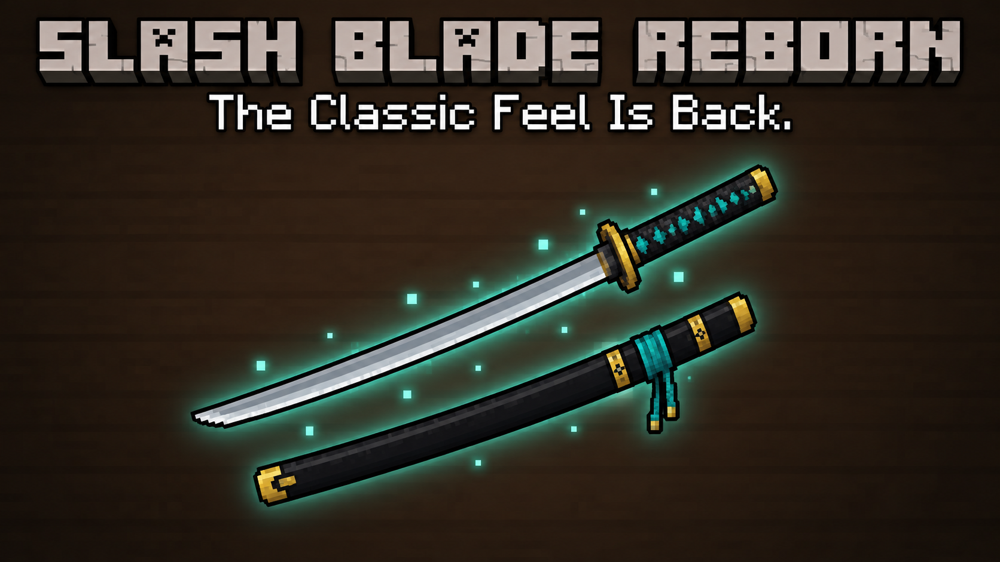

# SEAC拔刀剑附属 旧梦重铸

本版更新与验证：[说明](docs/releases/0.2.0-dev.5.md)。

**[⬇ 直接下载旧梦重铸 0.2.0-dev.5 运行 JAR](https://github.com/rianfalltwilight-lab/seac-slashblade-old-dream-reforged/releases/download/v0.2.0-dev.5/SEAC-SlashBlade-Old-Dream-Reforged-1.21.1-0.2.0-dev.5.jar)**

适用于 Minecraft 1.21.1；下载后放入 mods。无需下载源码或选择 Git 标签。

非官方 SlashBlade: Resharpened 双端附属，当前 **0.2.0-dev.5**。以 **mc1.7.10-r87** 为主动行为基准，保留现代保护接口及明确兼容适配。开发预发布，未部署生产。

MC 1.21.1 / NeoForge 21.1.248 / Java 21。实际验证重锋 2.0.5-1.21.1；版本号软绑定不代表所有内部 API 兼容。客户端和服务器须使用同一版本；modId 为 slashblade_legacy_compat。

恢复旧连段、范围与伤害、幻影剑/剑阵/SB、九种基础 SA、附魔/锻造/断刀/刀魂与修复；保留配置生命周期修正、第一人称视角补偿、收刀嘲讽和神钢抢夺 III。详情与外部候选关系见 [更新说明](docs/releases/0.2.0-dev.5.md) 和 [验证范围](VALIDATION.md)。

## 构建

`./gradlew --no-daemon clean build runContracts`

构建自动下载并校验精确重锋依赖；不嵌入第三方 JAR。runContracts 使用隔离世界并运行 r87 契约，不连接生产。clientProbeJar、serverContractsJar、persistenceProbeJar 仅供开发验证，不作为 Release 运行包。

## 安装和回退

仅将运行 JAR 安装到双端 mods。先备份配置、世界和原模组组合，在副本验证升级/回退；新组合状态和在途实体不能只靠删 JAR 保证无损回退。NR/SI 配套候选需另行获取和验收，本仓库不分发其源码或二进制。

## 许可证与披露

独立代码 [MIT](LICENSE)，旧版衍生内容保留 [r87 原文](LICENSE-LEGACY17-README.txt) 及 [1.12 原文](LICENSE-LEGACY-README.txt)。参见 [第三方来源](THIRD-PARTY-NOTICES.md)、[NOTICE](NOTICE) 与 [AI 披露](AI-GENERATED.md)。

[English](README_en.md)